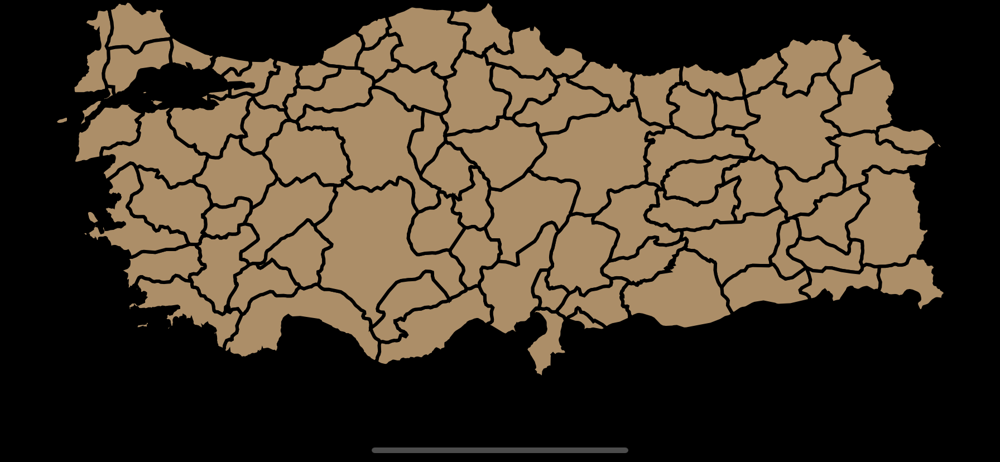
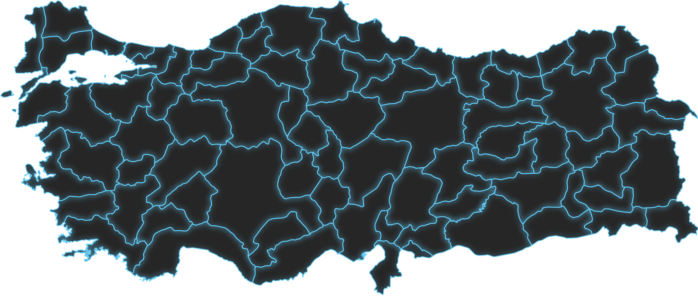

# InteractiveMap

A Library to use SVG Based Maps interactively in SwiftUI.


- Works **only with** .svg based maps
- Allows you to modify **all** the provinces in the map with the attributes that SwiftUI's `Shape` provides
- Drag, drop and animate the provinces, as well as the map itself.

<h3 style ="text-align: center">Installation</h3> 
<p>Requires <b>iOS 13+</b> 

InteractiveMap currently can only be installed through the Swift Package Manager.</p>

<table>
<tr>
<td>
<strong>
Swift Package Manager
</strong>
<br>
Add the Package URL:
</td>
</tr>
<tr>
<td>
<br>
    
```
https://github.com/GrandSir/InteractiveMap
```
    
</td>
</table>

<h2 style="text-align: center; padding: 10px">Usage</h2>

To draw your svg map in SwiftUI, use `MapView` with a closure taking `Province` as the parameter.

```swift
import SwiftUI
import InteractiveMap

struct ContentView: View {
    var body: some View {
        MapView(svgName: "tr") {
            ProvinceShape($0)
                .initWithAttributes()
        }
    }
}
```
MapView resizes itself to the assigned frame, and takes all available space by default.


# Customization

Instead of using default attributes, you can define your own as well. 

```swift
MapView(svgName: "tr") {
    ProvinceShape($0)
        .initWithAttributes(.init(strokeWidth: 2, strokeColor: .red, background: Color(white: 0.2)))
}
```


## Advanced Customization

Even though `.initWithAttributes` saves time for simple customization, it is neither highly customizable nor editable.

Since `ProvinceShape` is a `Shape`, you can add any attribute to `ProvinceShape` that you can add to `Shape`.
```swift
MapView(svgName: "tr") {
    ProvinceShape($0)
        .stroke(Color.cyan)
        .shadow(color: .cyan, radius: 3, x: 0, y: 0)
        .background(ProvinceShape($0).fill(Color(white: 0.15)))
}
```


### Handling Clicks
`Province` is a `Struct` that contains all the information about province.
It has 3 variables inside it. `id`, `path` and `name`

`id` is the Unique Identifier that's being parsed directly from SVG

Most of the Map SVG's (NOT ALL!) has the `id` attribute in all in their `<path>` element like this:

`<path ... id="<id>", name="<name>">`

`MapParser`, defined in `MapParser.swift` parses that element and stores them in `Province` struct.

If there is not any `id` attribute in path, MapParser automatically creates an UUID String.

But if you're going to store that id in somewhere, be aware that UUID String is automaticaly regenerated every time MapView is being drawed.

```swift
import SwiftUI
import InteractiveMap

struct ContentView: View {
    @State private var clickedProvince = Province.EmptyProvince
    var body: some View {
        VStack {
            Text(clickedProvince.name.isEmpty ? "" : "\(clickedProvince.name) is clicked!" )
                .font(.largeTitle)
                .padding(.bottom, 15)

            MapView(svgName: "tr") { province in // is a Province
                ProvinceShape(province)
                    .stroke(clickedProvince == province ? .cyan : .red, lineWidth: 1)
                    .shadow(color: clickedProvince == province ? .cyan : .red,  radius: 3)
                    .shadow(color: clickedProvince == province ? .cyan : .clear , radius: 3) // to increase the glow amount
                    .background(ProvinceShape(province).fill(Color(white: 0.15))) // filling the provinces
                    .shadow(color: clickedProvince == province ? .black : .clear , radius: 5, y: 1) // for depth

                    .onTapGesture {
                        clickedProvince = province
                    }
                    .zIndex(clickedProvince == province ? 2 : 1) // this is REQUIRED because ProvinceShapes overlap, resulting in an ugly appearance
                    .animation(.easeInOut(duration: 0.3), value: clickedProvince)
            }
        }
    }
}
```
`clickedProvince == province` basically compares the id's of the Provinces.

https://user-images.githubusercontent.com/69051988/191269654-5084ffb5-29a4-47fa-be0c-cb7c7b59aee0.mov

# Examples
[3D Scaling Effect](./Examples/3DEffect.swift)


